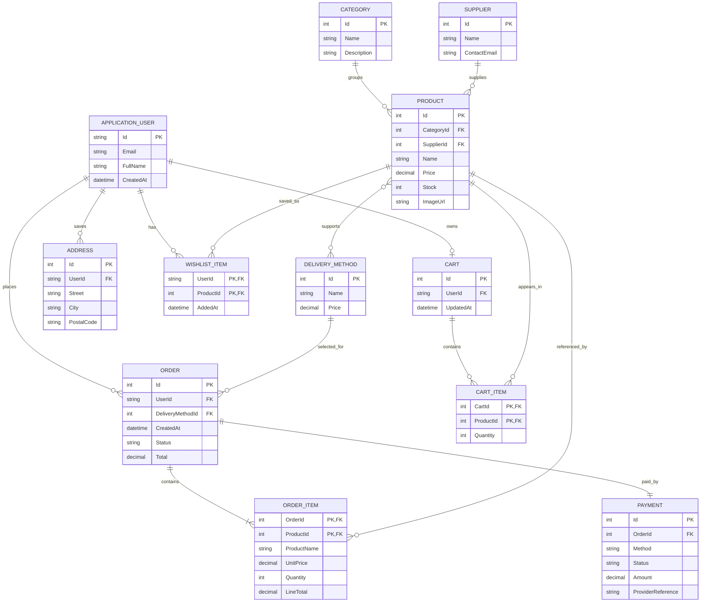

# UniShop ER Diagram

```mermaid
erDiagram
    APPLICATION_USER ||--o| CART : owns
    APPLICATION_USER ||--o{ ADDRESS : saves
    APPLICATION_USER ||--o{ ORDER : places
    APPLICATION_USER ||--o{ WISHLIST_ITEM : has
    CART ||--o{ CART_ITEM : contains
    PRODUCT ||--o{ CART_ITEM : appears_in
    PRODUCT ||--o{ WISHLIST_ITEM : saved_as
    CATEGORY ||--o{ PRODUCT : groups
    SUPPLIER ||--o{ PRODUCT : supplies
    PRODUCT }o--o{ DELIVERY_METHOD : supports
    ORDER ||--|{ ORDER_ITEM : contains
    PRODUCT ||--o{ ORDER_ITEM : referenced_by
    ORDER ||--|| PAYMENT : paid_by
    DELIVERY_METHOD ||--o{ ORDER : selected_for

    APPLICATION_USER {
        string Id PK
        string Email
        string FullName
        datetime CreatedAt
    }
    CART {
        int Id PK
        string UserId FK
        datetime UpdatedAt
    }
    CART_ITEM {
        int CartId PK, FK
        int ProductId PK, FK
        int Quantity
    }
    WISHLIST_ITEM {
        string UserId PK, FK
        int ProductId PK, FK
        datetime AddedAt
    }
    ADDRESS {
        int Id PK
        string UserId FK
        string Street
        string City
        string PostalCode
    }
    CATEGORY {
        int Id PK
        string Name
        string Description
    }
    SUPPLIER {
        int Id PK
        string Name
        string ContactEmail
    }
    PRODUCT {
        int Id PK
        int CategoryId FK
        int SupplierId FK
        string Name
        decimal Price
        int Stock
        string ImageUrl
    }
    DELIVERY_METHOD {
        int Id PK
        string Name
        decimal Price
    }
    ORDER {
        int Id PK
        string UserId FK
        int DeliveryMethodId FK
        datetime CreatedAt
        string Status
        decimal Total
    }
    ORDER_ITEM {
        int OrderId PK, FK
        int ProductId PK, FK
        string ProductName
        decimal UnitPrice
        int Quantity
        decimal LineTotal
    }
    PAYMENT {
        int Id PK
        int OrderId FK
        string Method
        string Status
        decimal Amount
        string ProviderReference
    }
```
